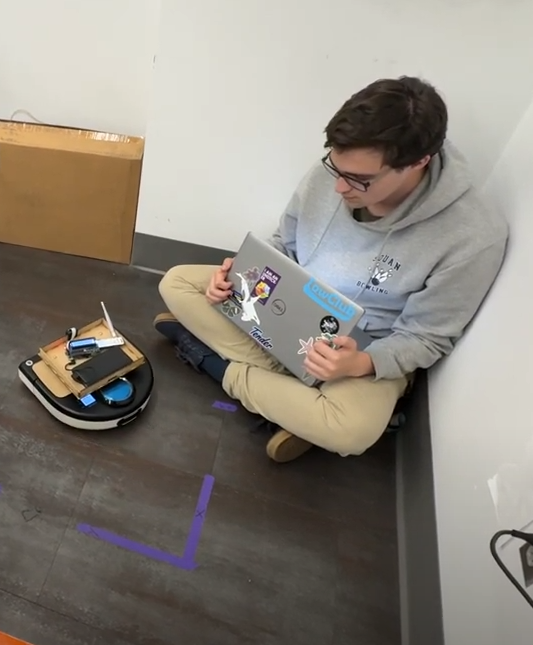
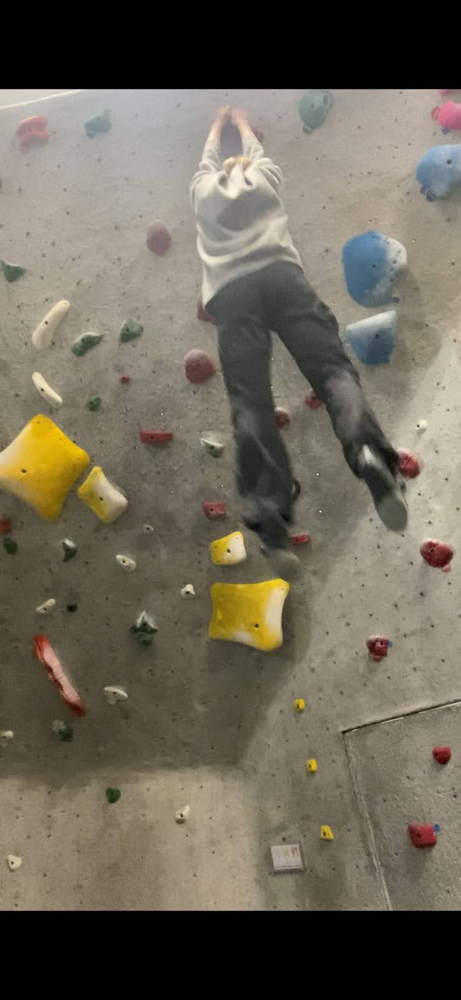

# Our Team

## Team Members

### Daniel Theunissen

Learning goals:
- Cut Arduino IDE out of my life by switching to PlatformIO
- Learn how to interface with a display using a microcontroller
- Research and develop the electrical components of the modules
- Create good documentation, establish consistent design rules, and set up maintainable systems
- Hopefully work on modularity: I think hot swappable modules would be really cool

### Charlie Mawn

Learning Goals:
- Expanding on my own knowledge of how to program arduino
- Learning how to use PlatformIO to write Arduino code without the terrible Arduino IDE
- Gain a better understand of how to integrate electrical and software components together
- Get a baseline understanding of how the mechanical components are designed to house the electronics

### Alex Mineeva

Learning goals:
- Project management of a semester-long integrated engineering project
- Develop gameplay testing procedures to gather relevant data for human-centered product development 
- Designing an aesthetically pleasing mechanical system that houses each game module + their related electrical components
- Fabricate the box™ using wood, metal, and fabric. 

### Joshua Espinoza Diaz

Learning goals:
- Explore different ways to develop a modular project that is reliable and can be expanded in the future.
- Practice creative problem solving skills by finding ways to simply complex systems into alternative modules with similar user experience.
- Develop a better understanding of circuit design for small modules.
- Develop good documentation habits for project development.

---
## Team Structure

### Weekly Meeting structure
We had 3 meetings every week:
- Mondays: Outside of class
    - Focus on integration, team meeting
- Tuesday: In-class
    - Scrum/Sprint Review
    - Individual work time
- Friday: In-class
    - Individual work time

### Housekeeping:
- Communication + Sharing pictures - WhatsApp
- Task Tracking - Kanban board on whiteboard
- Document Sharing - Google Drive
- Code Collaboration - GitHub
- Website - Github Pages

---
### Task-tracking Kanban!

### Whiteboard of idea generation

