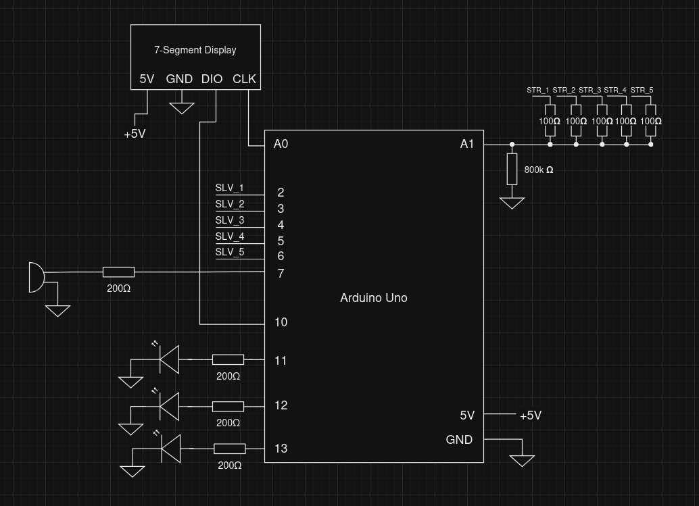
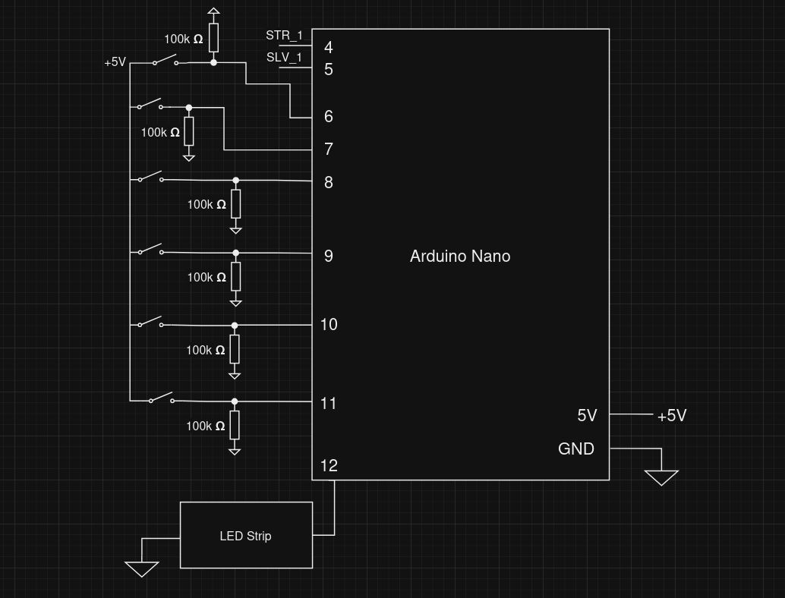
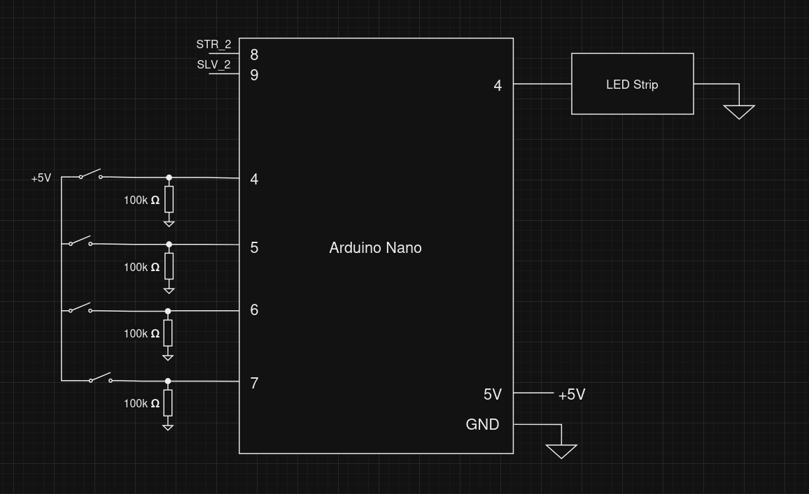

# Electrical

## General

The electrical system includes all of the module hardware and inter-module communication. We used 6 total microcontrollers, each running their own firmware. 
- Timer - Arduino Uno
- Wires - Arduino Nano
- Morse Code - Arduino Nano
- Memory - Arduino Nano
- Keypad - ESP32
- Button - ESP32

## Modules

### Timer

The timer module interfaces with a 7-segment display through a 2-wire (Clock and a bidirectional DIO) protocol that is similar to I2C electrically. There is also a buzzer and 3 LEDs to indicate a loss and strikes respectively. 

All of the strike inputs are fed into a single analog input with a pulldown resistor. If the voltage on the pin is higher than 0V, then a strike is registered. The 100 ohm resistors are there to prevent current from flowing into the modules.

### Wires

The Wires module simply has a bunch of switches with pullup resistors to get user input as well as an LED strip which uses a PWM pin.

### Morse Code

The Morse Code module uses a potentiometer connected to the analog pin A0 to obtain a variable input that is required in the module.

### Memory

The Memory module connects the 4 buttons directly to a digital pin in the arduino nano, using the internal pull-up resistors in the arduino to avoid erratic behaviour introduced by static noise. The LEDs used for the display, buttons and the stage progress bar, are connected in series and act essentially as a single addressable LED strip, connecting to a single digital port in the arduino.

### Keypad

The keypad module connects the two I2C OLED displays to the same interface (connections to the arduino). To differentiate between screens, the connection of the resistor used to set the address of the display was changed to use a different address.

Keypad uses an SPI OLED display as well as 4 switches with pulldown resistors.

### Button

### Connectors

To interface with our central module, we made some custom molex connectors that supply power and allow for communication. The yellow wire carries strike information while the blue wire carries solve information.
