# Process

## Sprints

Our project was split into 3 2-week long sprints. Here is a description of what we accomplished in each sprint. 

### Sprint 1: Initial Design Exploration

- Created an initial energy flow diagram (see [about](about.md) page for more details)
- Built Morse Code and Wires modules

---

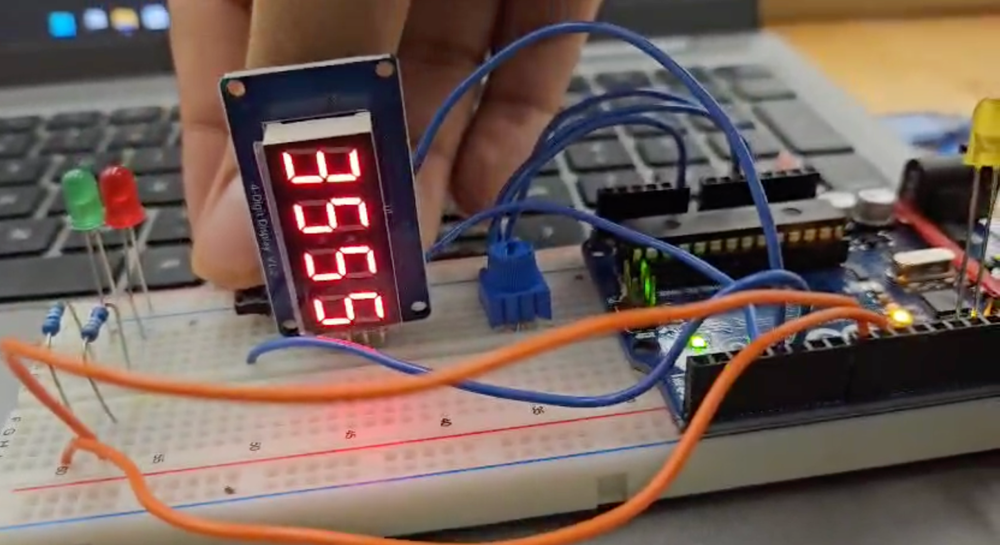

---

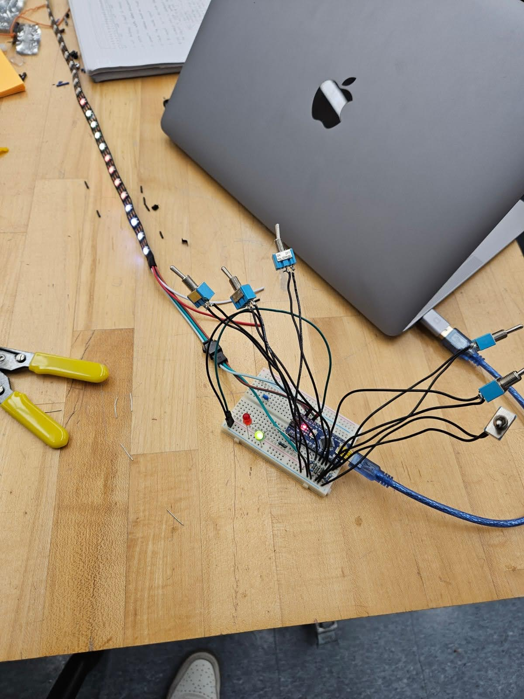

---

- Made progress on keypad
---
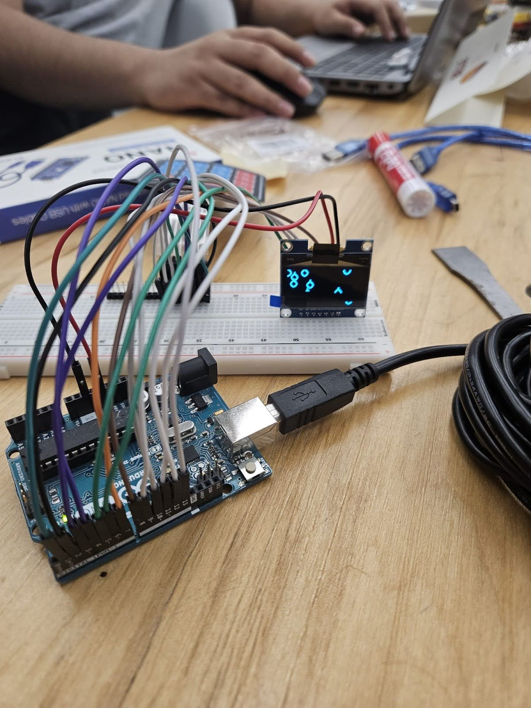

---
- Started work on the central controller
- Initial module dimension sketches
---

    

        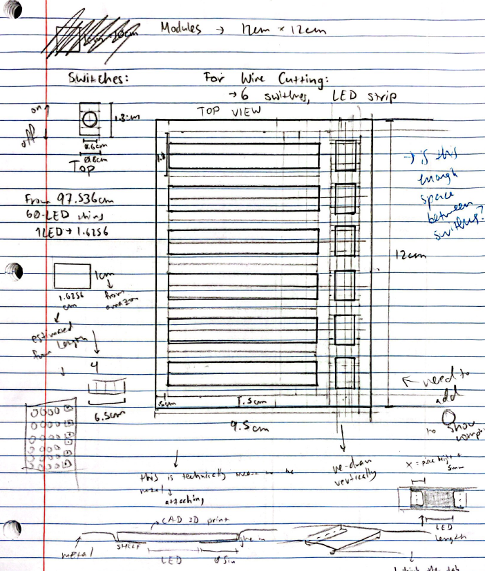
    

    

        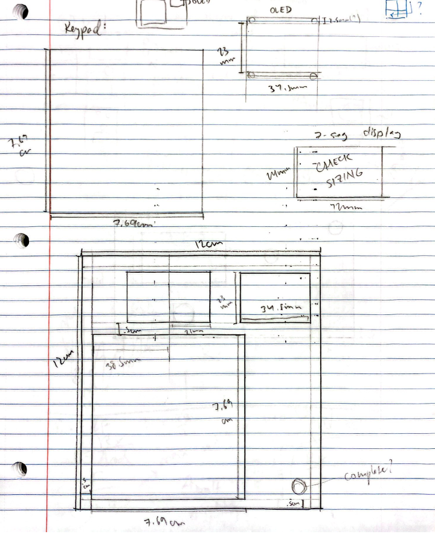
    

    

        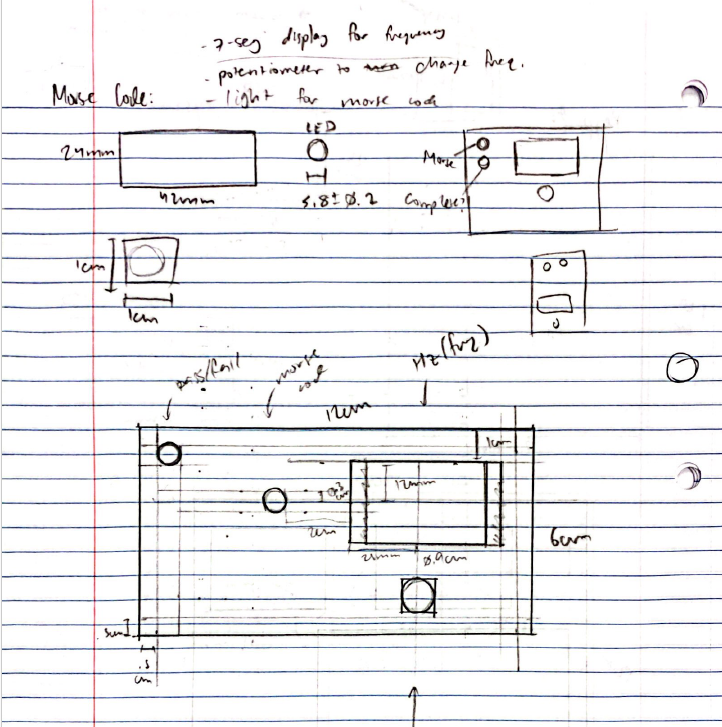
    

---
### Sprint 2: Continued Iteration + Progress
- Developed memory, keypad, button

    

        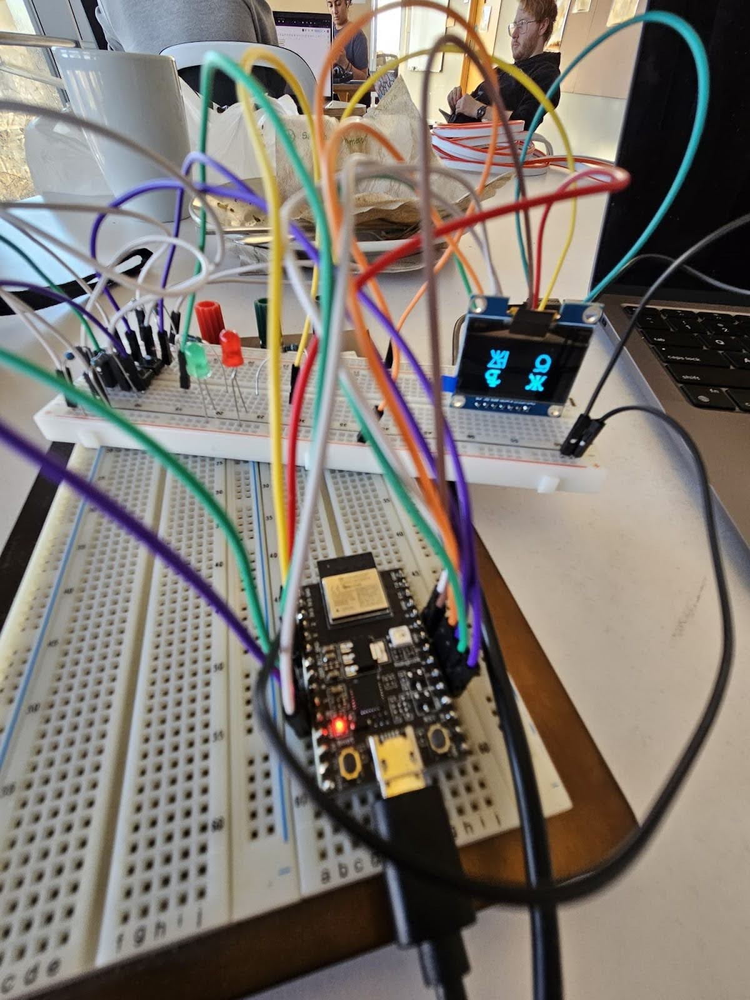
    

    

        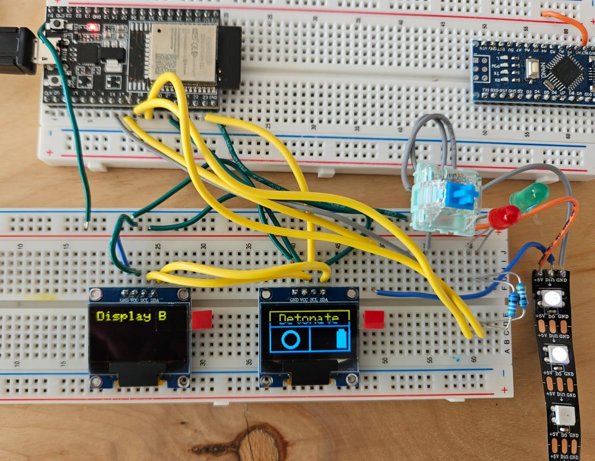
    

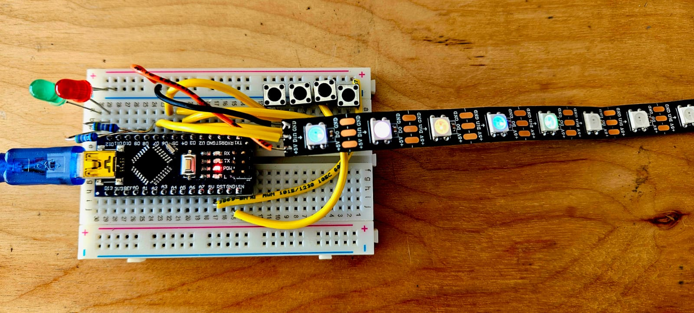

---
- Continued working on the central timer module
- Experimented with and determined inter-module communication
- CAD of suitcase
    - Took into account electrical integration considerations
---

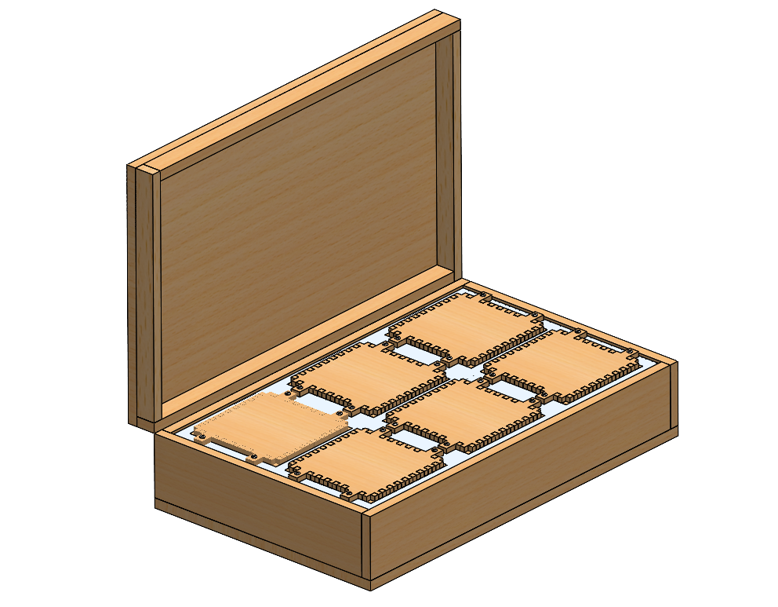

---
- bent/cut/sanded the sheet metal top
- Iterated module dimensions
---

---
- First fully integrated module! Morse Code
---

    

---

### Sprint 3: Full Integration + Finishing touches

- Fully integrated demonstration
- All modules in their final state
- Suitcase fully glued, stained, and furnished with internal rod supports, hinges, and clasp
- Final sanding to get modules to fit into metal sheet, final sanding to get metal sheet to fit into suitcase

**Play Test Demo Video**

<iframe width="560" height="315" src="https://www.youtube.com/embed/_wYyFdkVm0g?si=mWVxMoW6ASCMlR6o" title="Play Test Demo" frameborder="0" allow="accelerometer; autoplay; clipboard-write; encrypted-media; gyroscope; picture-in-picture; web-share" referrerpolicy="strict-origin-when-cross-origin" allowfullscreen></iframe>

### Pre-Demo Day: Play-testing & usability
- Completed player manuals
- Included game introduction page on the inner suitcase top (linked at top of page too)
- Play-tested to debug modules
---

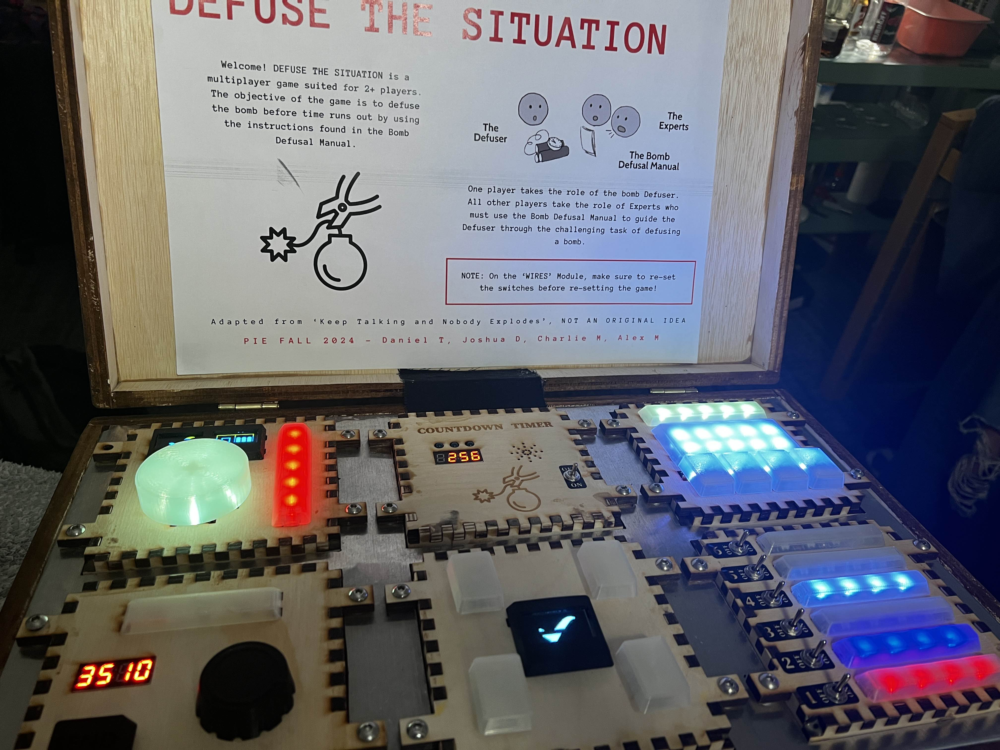

---

